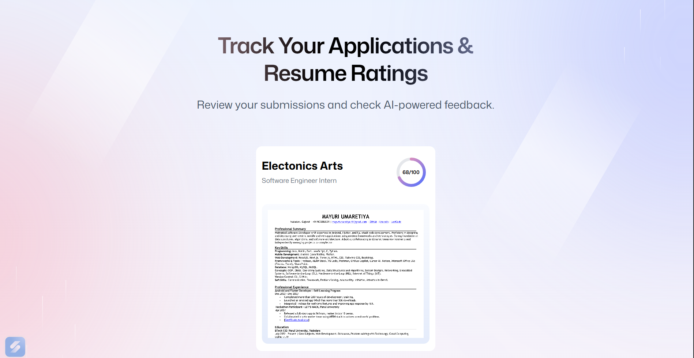
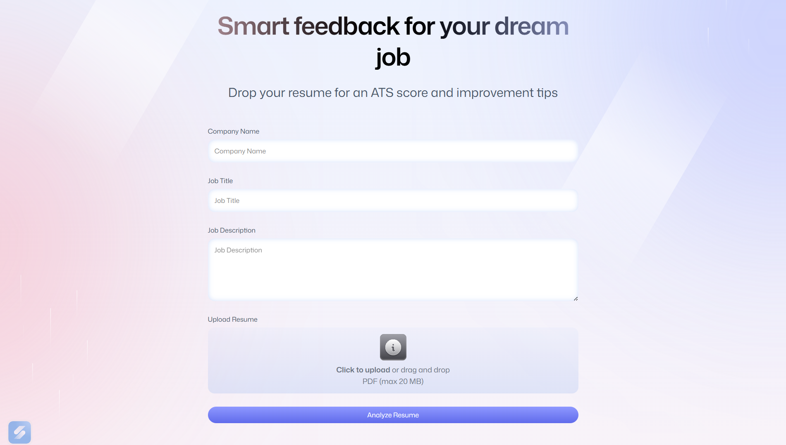

# 🌟 AI Resume Analyzer — Smart Resume Evaluation Powered by AI

<p align="center">
  
</p>

> 🚀 An intelligent, serverless, and AI-powered web app that helps users upload, analyze, and match resumes to job listings — built by **Mayuri** using **React**, **Puter.js**, and **Tailwind CSS**.

---

## 🧠 Overview

The **AI Resume Analyzer** empowers users to evaluate their resumes against job postings using **AI-based scoring and feedback**.  
It provides **ATS compatibility scores**, **AI suggestions**, and **keyword matching insights** — all directly from the browser, with **zero backend setup** thanks to **Puter.js**.

---

## 🖼️ Project Preview

| Dashboard | AI Feedback | Resume Upload |
|:--:|:--:|:--:|
|  | |  | 

---

## ⚙️ Tech Stack

| Technology | Description |
|-------------|-------------|
| **React (v18)** | Build scalable and interactive UIs using component-based architecture |
| **React Router v7** | Simplifies navigation with nested routes, loaders, and SSR support |
| **Puter.js** | Adds serverless authentication, storage, database, and AI capabilities directly in-browser |
| **Puter.com** | A personal, privacy-first cloud OS used for data and file storage |
| **Tailwind CSS** | Modern utility-first CSS framework for building responsive UI |
| **TypeScript** | Brings static typing and better tooling to JavaScript |
| **Vite** | Blazing fast build tool for modern frontend projects |
| **Zustand** | Minimal state management for global React state handling |

---

## ✨ Features

✅ **Browser-based Auth** – Sign in securely using Puter.js without backend configuration  
📄 **Resume Upload & Storage** – Manage and store resumes on Puter’s cloud OS  
🤖 **AI Resume Analyzer** – Generate ATS scores and feedback against any job listing  
🧩 **Reusable Components** – Modular design for scalability and easy maintenance  
📱 **Responsive Layout** – Works smoothly on all devices  
🎨 **Modern UI/UX** – Built with Tailwind CSS and shadcn/ui for a clean, intuitive look  
⚡ **High Performance** – Vite + Zustand ensures fast loading and efficient state updates  

---

## 🛠️ Installation & Setup

Follow the steps below to set up and run the project locally 👇

### Prerequisites
- [Node.js](https://nodejs.org/) (v18+)
- [npm](https://www.npmjs.com/)
- [Git](https://git-scm.com/)

### 1️⃣ Clone the Repository
```bash
git clone https://github.com/mayuri-dev/ai-resume-analyzer.git
cd ai-resume-analyzer

**Installation**

Install the project dependencies using npm:

```bash
npm install
```

**Running the Project**

```bash
npm run dev
```

